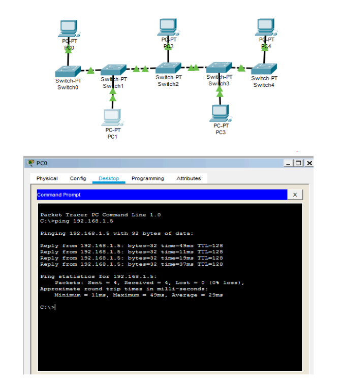
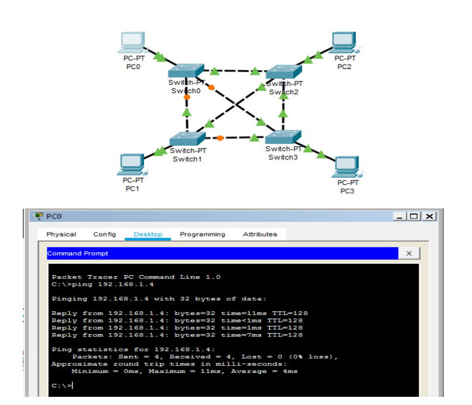
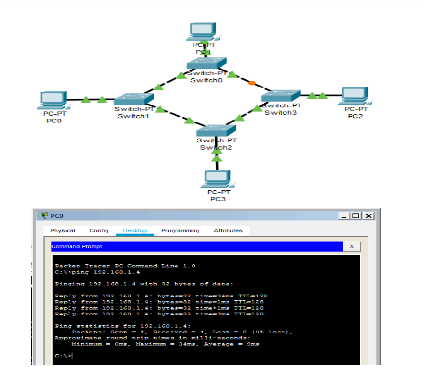
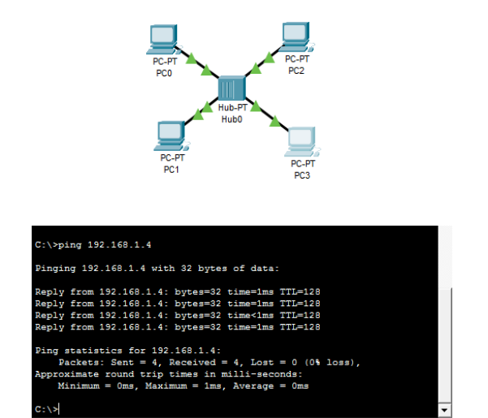
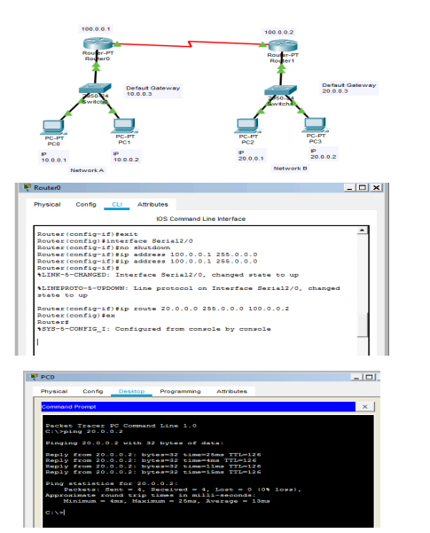
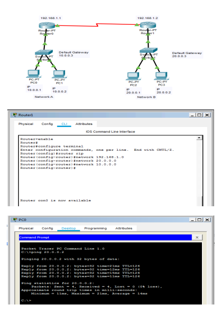
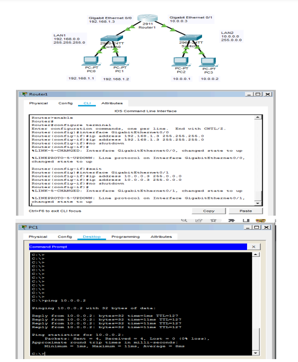

# Networking using Cisco Packet Tracer - Static & Dynamic Routing

This repository contains various **network topology simulations** created using **Cisco Packet Tracer**.  
Each `.pkt` file demonstrates different networking concepts such as **static routing, dynamic routing, topology structures, and router configurations**.

---

##  **Topologies and Routing Configurations**

| Topology | Description | Screenshot |
|----------|------------|------------|
| **Bus Topology** | A **bus network** where all devices share a common communication line. |  |
| **Mesh Topology** | A **fully connected** network with multiple redundant paths. |  |
| **Ring Topology** | A **ring-based network** where each device is connected to two other devices. |  |
| **Star Topology** | A network where all devices are **connected to a central hub or switch**. |  |
| **Static Routing** | **Manually configured routes** to enable communication between different networks. |  |
| **Dynamic Routing (RIP)** | Demonstrates **RIP (Routing Information Protocol)** for automatic route learning. |  |
| **Router Configuration** | A **basic router setup** with IP addressing and interface configuration. |  |

---

##  **How to Use the Files**
1. Download and install **Cisco Packet Tracer**.
2. Clone this repository or download the `.pkt` files manually:
   ```bash
   git clone https://github.com/KaushalB/Networking-using-Cisco-Packet-Tracer.git
